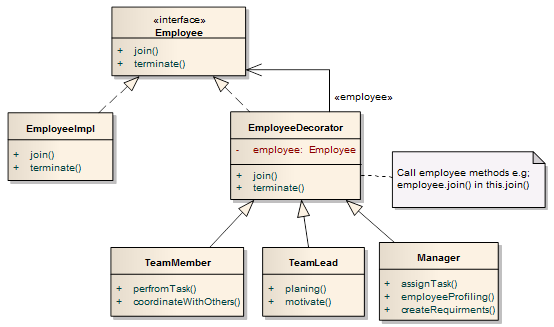

# GRASP

**GRASP** - general responsibility assignment software patterns — общие шаблоны 
распределения ответственностей. GRASP шаблоны, используемые в объектно-ориентированном
проектировании для решения общих задач по назначению ответственностей классам и объектам.

## 1. Информационный эксперт (Information Expert):

```
  Ответственность должна быть назначена тому, кто владеет максимумом необходимой 
  информации для исполнения — информационному эксперту.
```

Шаблон решает проблему распределения обязанностей между объектами в 
объектно-ориентированной системе. Под обязанностью в контексте GRASP понимается 
некое действие (функция) объекта. Т.о. Information Expert дает рекомендации 
касательно того, какие функции должен выполнять тот или иной объект. А решение
очень простое и понятное без доказательств: назначать обязанность следует 
информационному эксперту - классу, у которого имеется информация, требуемая для 
выполнения обязанности.

### Example (aggregate similar responsibilities in the same class):
```js
class ShoppingCart {
  orders: Order[];

  addOrder(order: Order) {
    this.orders = [order, ...this.orders];
  }

  getTotal() {
    return this.orders.reduce((total, order) => {
      return (total += order.cost);
    }, 0);
  }
}
```
So if we want to add a new feature, to count the total cost of our shipping card, we
should add this function to the ShoppingCart class. Why? Because this class knows
everything about orders, so this is the best place for this.

### Violation of Information Expert pattern:
  - **wrong usage (use inherited methods from prototype):**  
    <ins>Wrong:</ins>  ❌
    ```js
      ShoppingCartInstance.prototype.Cart.property...
    ```
    <ins>Right (use only current class methods / properties):</ins> ✅
    ```js
      ShoppingCartInstance.orders;
    ```
    
  - **add new methods and props from the outside of the class / instant:**  
    <ins>Wrong (mixin):</ins>  ❌
    ```js
      ShoppingCart.newMethod = () => {};
    ```
    <ins>Right (add new methods and props only inside the class):</ins> ✅
    ```js
      class ShoppingCart {
        orders: Order[];
    
        newMethod() {} // !!!!!!!!!!!!!!!!!!!!!!!!!!!!!!!!!!!!
    
        addOrder(order: Order) {
          this.orders = [order, ...this.orders];
        }
        
        getTotal() {
          return this.orders.reduce((total, order) => {
            return (total += order.cost);
          }, 0);
        }
      }
    ```
  - **change methods and props from the outside of the class / instant:**  
    <ins>Wrong (patch):</ins>  ❌
    ```js
      ShoppingCart.getTotal = () => {};
    ```
    <ins>Right (change methods and props only inside the class):</ins> ✅
    ```js
    class ShoppingCart {
      orders: Order[];
    
      addOrder(order: Order) {
        this.orders = [order, ...this.orders];
      }
      
      newGetTotal() { // !!!!!!!!!!!!!!!!!!!!!!!!!!!!!!!!!!!!
        return this.orders.reduce((total, order) => {
          return (total += order.cost);
        }, 0);
      }
    }
    ```
    
### Improvements:
**Повышает:**
  - Инкапсуляцию;
  - Простоту восприятия;
  - Готовность компонентов к повторному использованию;

**Снижает:**
  - Степень зацепления;

## 2. Создатель (Creator):
```
Definitely which object should be responsible for creating a class Y instance. 
```
Шаблон Creator решает проблему о том, кто должен создавать экземпляры новых классов. 
Решение состоит в назначении классу B обязанностей создавать экземпляры класса A, 
если выполняется одно из условий:
  - Класс B агрегирует (aggregate) объекты A;
  - Класс B содержит (contains) объекты A;
  - Класс B записывает (records) экземпляры объектов A;
  - Класс B активно использует (closely uses) объекты A;
  - Класс B обладает данными инициализации (has the initializing data), которые 
    будут передаваться объектам A при их создании (т.е. при создании объектов А 
    класс В является экспертом);
    
### Example:
  - **Constructor:**  
    Assume that we have a diary class that contains our notes. We can easily create 
    our note inside the Diary, because it contains the list of Notes.
    ```js
    export class Diary {
      notes: Notes[];
        
      addNote(title: string, content: string){
        this.notes.push(Notes.create(title, content)) // creating Notes (класс A) by Diary constructor (Класс B) !!!!!!!!!!!!!!!!!!!!!!!!!!!!!!1
      }
    }
    ```
  - **Fabric;**
  - **Pool;**

### Improvements:
  - Поддерживается шаблон Low Coupling through **dependency injection**;
  - Снижаются затрат на сопровождение и обеспечивается возможности повторного 
    использования созданных компонентов в дальнейшем.
    
## 3. Контроллер (Controller):

```text
Отвечает за операции, запросы на которые приходят от пользователя, и может выполнять
сценарии одного или нескольких вариантов использования (например, создание и удаление);
Не выполняет работу самостоятельно, а делегирует компетентным исполнителям.
```

[](../../../../images/Model-View-Controller-Design-Pattern.ppm)

Шаблон сontroller решает давнюю проблему разделения интерфейса и логики в 
интерактивном приложении. Это не что иное, как C из аббревиатуры MVC. Этот шаблон
отвечает за то, к кому именно должны обращаться вызовы из V (View), и кому C должен
делегировать запросы на выполнение (какая модель M должна их обработать). Если 
обобщить назначение сontroller, то он должен отвечать за обработку входных системных
сообщений. Под системными сообщениями здесь понимаются события высокого уровня, 
генерируемые внешним исполнителем.

### Example:
  - Isolation layer;
  - Facade;
  - Abstraction;
  - ...

### Improvements:
  - Decoupling layer / interfase for communication between user and model / business
    logic / service layer / db... 

## 4. Слабое зацепление (Low Coupling):
```text
High coupling - is when one class use or depends on the implementation details of 
another class.
Low coupling - is when we depend on abstraction and encapsulation. It's when the 
second class exposes some public methods, which allows us to access important data.
```


Шаблон решает проблему связности. Связность можно определить как количество точек 
соприкосновения классов между собой. Известно, что чем ниже связность классов, тем 
меньше их взаимовлияние, тем выше возможность повторного использования. А 
рекомендация здесь простая: распределять обязанности между классами надо таким 
образом, чтобы уменьшить связность.

### Types:
  - **Content Coupling** - when one module talks directly with another module. It 
    means that module X use implementation details from module Y.
  - **Common Coupling** - when two separated module depends on some shared state.
    It could be some variable for example. In this case, they don't talk directly 
    to each other, but by some other value.
  - **External Coupling** - if two modules want to talk to each other, they use 
    some external interface. When the interface has been changed, it can no longer
    communicate anymore.
  - **Control Coupling** - one module tells another module how to do his job. It 
    can be done by passing a flag, which will manipulate another module by turning 
    off/on some kind of business logic.
  - **Stamp Coupling** - we pass some data structure from one module to another,
    and this module use only part of the passed data to do their job. We depend on
    the whole data structure even if we need only some data from it.
  - **Data Coupling** - we pass from one module to another only data which are
    necessary by this module to do their job.

### Violation of Low Coupling pattern:
  - Circular dependency;
  - Direct changes of the inner properties and methods (see Violation of Information
    Expert pattern);
  - ...

### Improvements:
  - Имеет слабую зависимость от других классов;
  - Не зависит от внешних изменений (изменение в одном классе оказывает слабое 
    влияние на другие классы);
  - Прост для повторного использования.
  - Прост для тестирования.

## 5. Высокая связность (High Cohesion):
```text
High Cohesion твердит, что класс должен стараться выполнять как можно меньше не 
специфичных для него задач, и иметь вполне определенную область применения.
```


Зацепление (cohesion) (или более точно, функциональное зацепление) - это мера 
связанности и сфокусированности обязанностей класса. Считается, что элемент обладает
высокой степенью зацепления, если его обязанности тесно связаны между собой и он не
выполняет огромных объемов работы. Класс с низкой степенью зацепления выполняет 
много разнородных функций или несвязанных между собой обязанностей.

### Types:
  - **Coincidental** - two functions are in one module by accident and nothing 
    connects them. Classes like utilities or shared are the best example of the 
    coincidental cohesion.
  - **Logical** - when, at first glance, the two entities are connected, but after 
    deeper consideration, they would turn out to be completely different. For 
    example, two entities with similar names, but differentiated responsibility.
  - **Temporal** - two functions are in the same module because they must be 
    executed at the same time.
  - **Procedural** - the procedure needs some operation to be executed. So we 
    group all operations into one module.
  - **Communicational** - there are functions in the module that use the same data.
  - **Sequential** - there is a function, which returns data which the next 
    function needs. So we create a pipeline of executions.
  - **Functional** - functions are in one module because together they create a
    whole feature.
    
### Example:
<ins>Wrong:</ins>  ❌
```js
class Employee{
  id: string;
  name: string;
  address: Address;
  salaries: Salary[];

  getName(){}
  getAddress(){}
  getSalaryReport(){}
}
```

Here we have a class Employee with two methods, get name, and get a salary report. 
We can say that this is natural that employee has a salary, but are we really need 
this information in employee class? Should employee be responsible for creating a 
report? In my opinion not.

<ins>Right:</ins> ✅
```js
class Employee{
  id: string;
  name: string;
  address: Address;

  getName(){}
  getAddress(){}
}

class EmployeeSalary{
  employeeId: string;
  salaries: Salary[]

  getSalaryReport(){}
}
```
Now, we have an independent class. When we want to generate the report for an 
employee we retrieve EmployeeSalary class from the database and execute method 
getSalaryReport().

### Improvements:
  - Восприятие;
  - Повторное использование;
  - Поддержка;
  - Устойчивость к внешним изменениям.

## 6. Полиморфизм (Polymorphism):
```text
Замена конструкций if / switch case на полиморфные операции.
```


Принцип полиморфизма является основополагающим в ООП. В данном контексте шаблон 
Polymorphism решает проблему обработки альтернативных вариантов поведения на 
основе типа. Решать эту проблему стоит с использование полиморфных операций, а не
с помощью проверки типа и условной логики. Кроме того, при помощи полиморфизма 
легко создавать подключаемые компоненты.

### Example:
  - Adapter;
  - Strategy;
  - Chain of Resposibility;
  - Command;

### Violation of Low Coupling pattern:
  - if / switch case;

### Improvements:
  - Замена if / switch case операторов на программную абстракцию (методы с одинаковыми 
    названиями у разных сущностей);
  - Впоследствии можно легко расширять систему, добавляя новые вариации;
  - Новые вариации можно вводить без модификации клиентской части приложения;

## 7. Чистое изготовление (Pure Fabrication):

```text
Создание дополнительных слоев абстракций для High Cohesion и Low Coupling.
```

Формулировки и мотивации дополнительных шаблонов GRASP не так очевидны. И без 
примеров здесь трудно ориентироваться. Проблемой, решаемой Pure Fabrication,
является обеспечение реализации шаблонов High Cohesion и Low Coupling или других 
принципов проектирования, если шаблон Expert (например) не обеспечивает подходящего
решения. Решением может быть введение служебного класса, не представляющего понятия
конкретной предметной области, однако имеющего высокую степень зацепления.

### Example:
  - Any kind of abstractions for lowering coupling and increasing coherence
    (DAO, Repository, Promise, event emitter, Socket, async queue, logger,
    error handler, reusable utils, async/await...);

### Improvements:
  - Уменьшает зацепление;
  - Повышает связность;
  - Упрощает повторное использование;

## 8. Перенаправление (Indirection):

```text
Слабое зацепление между элементами системы (и возможность повторного использования)
обеспечивается назначением промежуточного объекта их посредником.
```


Шаблон решает проблему прямой связности. Решением является введение промежуточного
объекта для обеспечения связи между другими компонентами или службами, которые не
связаны между собой напрямую.

### Example:
  - Adapter; 
  - Facade; 
  - Observer;
  - Service;
  - Controller;
  - Mediator;
  - Interface;
  - High lvl abstraction under low lvl; 
  - ...

## 9. Устойчивость к изменениям (Protected Variations):

```text
Обеспечить устойчивость интерфейса.
```

[](../../../../images/042811_2030_designpatte31.png)

Основная проблема, решаемая шаблоном Protected Variations: как спроектировать 
объекты, подсистемы и систему, чтобы изменение этих элементов не оказывало 
нежелательного влияния на другие элементы необходимо идентифицировать точки
возможных вариаций или неустойчивости; распределить обязанности таким образом, 
чтобы обеспечить устойчивый интерфейс. Шаблон PV описывает ключевой принцип, на 
основе которого реализуются механизмы и шаблоны программирования и проектирования
с целью обеспечения гибкости и защиты системы от влияния изменений внешних систем.

Необходимо спроектировать систему так, чтобы изменение одних ее элементов не влияло
на другие. В качестве решения предлагается идентифицировать точки возможных 
изменений или неустойчивости и распределить обязанности таким образом, чтобы
обеспечить устойчивую работу системы.

### Example:
  - инкапсуляция данных; (hides the complexities of the system);
  - интерфейсы; (hides the complexities of the system);
  - полиморфизм; 
  - перенаправление;
  - Facade (hides the complexities of the system);
  - Decorator (added to an individual object, dynamically, without affecting the 
    behavior of other objects from the same class); 

# Conclusion:


