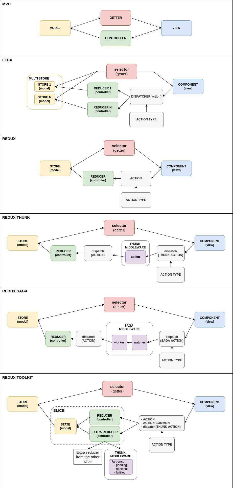

# Redux (oneway-directional):  

Redux is a library, which implements the idea of Flux but in a quite different way. Redux 
architecture introduces new components like:

  - **Reducer:** Logic that decides how your data changes exist in pure functions;
  - **Centralized store:** Holds a state object that denotes the state of the entire app;
  - **Action:** same as in Flux;

In Redux architecture, application event is denoted as an Action, which is dispatched to 
the reducer, the pure function. Then reducer updates the centralized store with new data 
based on the kind of action it receives. Store creates a new state and sends an update to view.


**1) Преимущество Redux над Flux:**  

**У Flux есть некоторые недостатки (функции):**
- Приложение может иметь несколько хранилищ, и могут быть зависимости между несколькими хранилищами,
  хранилища инкапсулируют данные и обрабатывают логику данных;
  
- Store mutation;

### Redux решает эти проблемы с помощью:

  - **Без диспатчера:** Redux избавляется от концепции диспатчера (dispatcher). Он может сделать
    это, потому что Redux имеет только одно хранилище, поэтому существует только один пункт 
    назначения для передачи новых действий (actions), что устраняет необходимость в диспатчере
    (dispatcher). Это позволило сделать store неизменяемым (immutable), с помощью функций
    (reducers) которые принимают previous state, изменяют его и возвращают полностью новый state.
    
  - **Единственный, менее запутанный store:** С Redux все состояние вашего приложения находится
    в централизованном хранилище (store), которое служит единственным источником правды 
    приложения. Кроме того, были уменьшены обязанности store — теперь он отвечает только за
    удерживание состояния, и больше не отвечает за определение того, как настроить его state 
    в ответ на actions.
    
  - **Reducers:** Редьюсеры — это чистые функции, которые принимают текущее состояние (state) 
    и заданное действие (action) в качестве аргументов, и выводят либо не измененное состояние,
    либо новую копию состояния. Здесь важен термин «копия» — Redux считает состояние неизменным.
    Если необходимо изменить состояние, оно не изменяется напрямую. Вместо этого создается 
    копия состояния, и редьюсер редактирует эту копию, затем возвращает ее, и заменяет исходное
    состояние его измененной копией.


**2) Пример:**  

**Action types:**
```js
    const ActionTypes = { 
      ADD_ITEM: "ADD_ITEM",
      REMOVE_ITEM: "REMOVE_ITEM"
    };
    
    export default ActionTypes;
```

**Actions:**
```js
    import ActionTypes from "./ActionTypes.js";
     
    const Actions = {
      addItem(text) {
        type: ActionTypes.ADD_ITEM, 
        text
      }, 
      removeItem(text) {
        type: ActionTypes.REMOVE_ITEM,
        text
      }
    };
     
    export default Actions;
```

**Reducer:**
```js
    import ActionTypes from "./ActionTypes.js";
 
    const initialState = ["Apple iPhone 12 Pro", "Google Pixel 5"];
 
    const reducer = (state = initialState, action) => {
        switch (action.type) {
            case ActionTypes.ADD_ITEM:
                if (action.text) {
                  return state.push(action.text);
                }
                return state;
            case ActionTypes.REMOVE_ITEM:
                let index = state.indexOf(action.text);
                if (index > -1) {
                    return state.delete(index);
                }
                return state;
            default:
                return state;
        }
    };

  export default reducer;
```

**Combine reducers:**
```js
    import { combineReducers } from 'redux';
    import Reducer1 from "../reducer1.js"
    
     const rootReducer = combineReducers({
      Reducer1,
    });

  export default rootReducer;
```

**Store:**
```js
    import { createStore } from 'redux';
    import rootReducer from '../rootReducer.js'

    const store = createStore(rootReducer);
    
    export default store;
```

**View:**
```js
import React from "react";
import Actions from "./Actions.js";

class AppView extends React.Component {
    constructor(props) {
      super(props);
      this.state = { newItem: "" };
         
      this.onInputChange = this.onInputChange.bind(this);
      this.onClick = this.onClick.bind(this);
    }
    onInputChange(e) {
      this.setState({ newItem:e.target.value });
    }
    onClick(e) {
      if(this.state.newItem) {
        this.props.store.dispatch(Actions.addItem(this.state.newItem)); // redux !!!!!!!!!!!!!!!!!!!!!!!
        this.props.store.subscribe(this.render); // add reactivity: after changing state, call render method
      }
    }
    render() {
      let remove = this.props.onRemoveItem;
      
      return <div>
        <input type="text" value={this.state.newItem} onChange={this.onInputChange} />    
        <button onClick={this.onClick}>Добавить</button>                
          <h2>Список смартфонов</h2>
            <div>
              {
                this.props.store.getState().phones.map(function(item) { // redux !!!!!!!!!!!!!!!
                  return <Phone key={item} text={item} store={this.props.store} />
                })
              }
            </div>
      </div>;
    }
}

// -------------------------------------CHILD-----------------------------------
class Phone extends React.Component{
    constructor(props) {
      super(props);
      this.state = { text: props.text };
      this.onClick = this.onClick.bind(this);
    }
    onClick(e) {
        this.props.store.dispatch(Actions.removeItem(this.state.text)); // redux !!!!!!!!!!!!!!!!!!!!!!!
    }
    render() {
      return <div>
        <p>
          <b>{this.state.text}</b><br />
          <button onClick={this.onClick}>Удалить</button> 
        </p>
      </div>;
    }
}
// -------------------------------------CHILD-----------------------------------

export default AppView;
```

**Add store to the App**:

```js
import AppView from "../views/AppView.js";
import React from "react";
import store from '../store.js';

class AppContainer extends React.Component
{
    render() {
      return <AppView store={store} />;
    }
}

export default Container.create(AppContainer);
```

**3) Conclusion: MVC vs Flux vs Redux:**  

  - Data Flow Direction:

|          MVC          |         Flux         |          Redux           |
|-----------------------|----------------------|--------------------------|
|Follows the two-directional flow|Follows the one-directional flow|Follows the one-directional flow|

  - Single or Multiple Stores:

|          MVC          |         Flux         |          Redux           |
|-----------------------|----------------------|--------------------------|
|No concept of store    |Includes multiple stores|Includes single store   |

  - Where Business Logic resides?:

|          MVC          |         Flux         |          Redux           |
|-----------------------|----------------------|--------------------------|
|Controller handles entire logic|Store handles all logic|Reducer handles all logic|

  - How Debugging is handled?:

|          MVC          |         Flux         |          Redux           |
|-----------------------|----------------------|--------------------------|
|Debugging is difficult due to two-directional flow|Ensures simple debugging with the dispatcher|Single store makes debugging lot easier by clear functions (reducers)|

  - Where can be used?:

|          MVC          |         Flux         |          Redux           |
|-----------------------|----------------------|--------------------------|
|Shines well in both client and server-side frameworks|Supports client-side framework|Supports client-side framework|
|Supports: Front-end frameworks like  AngularJS, Ember, Backbone, Sprout, and Knockout. Back-end frameworks like  Spring, Ruby on Rails, Django, Meteor.|Supports Front-end frameworks like  React, AngularJS, Vue.js, and Polymer|Supports Front-end frameworks like React, Vue.js, AngularJS, Ember, Backbone.js, Meteor, and Polymer|

[](../../../../images/mvc+redux.drawio.png)
